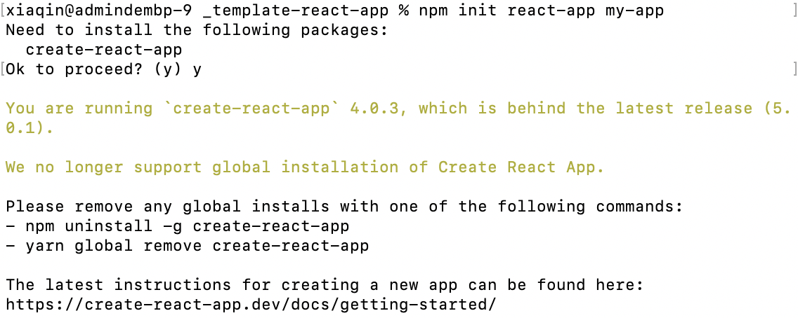

在创建项目的时候遇到下面的问题：



按照报错执行了

```bash
sudo npm uninstall -g create-react-app
```

但是问题是并没有效果， 重新执行创建还是同样的报错。怀疑是npm cache的问题

```bash
npm cache clean --force
npm cache verify
npx clear-npx-cache # 以清除npx缓存。
npx create-react-app your-app or npx create-react-app@latest my-app --use-npm
```

重新执行创建命令后， 成功创建项目